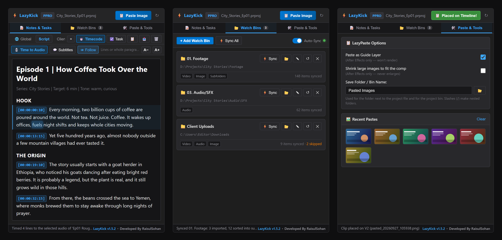

# ⚡ LazyKick — The Ultimate Adobe Workflow Companion

<p align="center">
  
  
  
  
  
  
</p>

<p align="center">
  <strong>One dockable panel for Adobe Premiere Pro and After Effects: paste clipboard images straight onto the timeline, keep project notes with live timecode stamps, and let watch folders import new media into your bins by themselves.</strong>
</p>

<p align="center">
  <a href="https://raisulsohan.com"><strong>🌐 raisulsohan.com</strong></a> •
  <a href="docs/README.md"><strong>📖 Documentation</strong></a> •
  <a href="#-installation">Install</a> •
  <a href="#-how-to-use">How to Use</a> •
  <a href="#%EF%B8%8F-architecture">Architecture</a> •
  <a href="#-development">Development</a> •
  <a href="#-troubleshooting--faq">Troubleshooting</a>
</p>

Developed by **[Raisul Sohan](https://raisulsohan.com)** · **Version 1.5.2** · Free & open source ([MIT](LICENSE)) · [Changelog](CHANGELOG.md)



> 📖 **[Read the full documentation](docs/README.md)**: [the manual](docs/manual.md), [how script timing works](docs/script-timing.md), [troubleshooting](docs/troubleshooting.md) and [building from source](docs/development.md).

---

## 📑 Contents

- [📖 Documentation](docs/README.md)
- [What's New in 1.5](#-whats-new-in-15)
- [What's New in 1.4](#whats-new-in-14)
- [What's New in 1.3](#whats-new-in-13)
- [What's New in 1.2](#whats-new-in-12)
- [What's New in 1.1](#whats-new-in-11)
- [Overview](#-overview)
- [Features](#-features)
- [Installation](#-installation)
- [How to Use](#-how-to-use)
- [Settings Reference](#%EF%B8%8F-settings-reference)
- [Supported File Types](#-supported-file-types)
- [Where LazyKick Keeps Your Data](#-where-lazykick-keeps-your-data)
- [Privacy](#-privacy)
- [Architecture](#%EF%B8%8F-architecture)
- [Project Structure](#-project-structure)
- [Development](#-development)
- [Troubleshooting & FAQ](#-troubleshooting--faq)
- [Roadmap Ideas](#%EF%B8%8F-roadmap-ideas)
- [Author & Credits](#-author--credits)
- [License](#-license)

---

## 🆕 What's New in 1.5

**📄 Paste from Google Docs and it looks like the Doc**
- Copy a script from Google Docs, Word or a web page and paste it into **📝 Notes**: titles, headings, paragraphs, **bold**, *italic*, underline, lists and small grey notes come across. Fonts, colours, links, images and anything hidden are left behind, in the panel's own dark style.
- Want plain text? **Ctrl+Shift+V** (Cmd+Shift+V).
- **Bigger text**: notes start at 14 px, and **A− / A+** make them smaller or bigger (remembered).

**👁 Follow the voiceover while it plays**
- After **🎙️ Time to Audio**, press play: the line being spoken lights up softly, the word being said glows, and the note scrolls along with it. No more searching for where you are.
- Scroll or click yourself and it waits a moment before following again. **👁 Follow** switches it off and on.

**🎙️ Smarter script timing and 💬 subtitles**
- Titles, headings and grey notes in the script are skipped: they are not spoken, so they get no time and no subtitle.
- Paste whole paragraphs: every sentence is matched to the voice on its own, so a paragraph no longer ends a sentence early when the reader pauses longer inside it than between paragraphs. Every word gets its own time too.
- A long paragraph becomes several subtitles, split at sentence ends, each one on time.

## What's New in 1.4

**1.4.1:** confirmations and messages (Reset, Unlink, Delete tab, …) now open as a dark in-panel dialog that matches Adobe's look, instead of a white Windows box with the text cut off.

**🎙️ Time a script to the voiceover, then 💬 make subtitles**
- Write your script in **📝 Notes**, one line per subtitle. Click **🎙️ Time to Audio**: LazyKick listens to the open sequence or composition and puts the time each line is spoken at the start of the line, like `[00:00:12:08] Welcome back.`
- Click **💬 Subtitles**: the timed lines go onto the timeline. **Premiere Pro** gets a subtitle caption track; **After Effects** gets one text layer per line (white with an outline, lower third, first line on top). An `.srt` is saved next to the project either way, ready for YouTube.
- **Works in any language, Bengali included.** No speech recognition and nothing to download: LazyKick finds the pauses in the voice and lays the lines over the speech by how long each takes to say. On real test voiceovers every line landed within a frame or two, also with music underneath.
- Only want the voiceover? **Select its clip (Premiere) or layer (After Effects)** first; music on other tracks is ignored while listening and switched back on after.
- Bengali subtitles in After Effects get a Bengali font (Nirmala UI on Windows) and the text engine that joins the letters correctly.
- Edited a timecode by hand? 💬 uses what you typed. Timecodes from **⏱️ Timecode** work too.

**📂 Watch Bins use the bin you already have**
- Link a folder the project already has a bin for (same name, holding its files) and that bin becomes the watch bin, wherever it sits, and is sorted like the folder on disk. No second bin of the same name any more.
- A project where 1.3 made a second "03. Videos" next to yours: click **⚡ Sync** once and the two become one; the empty copy is removed. Clips, sequences and comps in it move across first; nothing that holds anything is ever deleted.

## What's New in 1.3

**Watch Bins mirror your folders**
- **Subfolders become bins.** Link `Shoot` with *Include subfolders* on, and `Shoot/Day 1/Cam A/clip.mp4` lands in the bin `Shoot › Day 1 › Cam A`, nested exactly like the folders on disk. Works the same in After Effects (folders) and Premiere Pro (bins).
- **Bins that already exist are sorted for you.** A watch bin synced flat by an older version, or clips you moved around inside it, are put back into the bins that match the folders the next time you click **⚡ Sync** (Auto-Sync does it once per session too). Clips you dragged *out* of the watch bin are left where you put them.
- **Moved a file to another folder on disk? The clip follows it.** The existing clip is relinked to the new place and moved to the matching bin, instead of a second copy being imported, so your edits and comps keep working. LazyKick only relinks when the match is certain (same file name, and the folder names tell it apart); otherwise it imports the file as before.
- Files are imported in Explorer's order: subfolders first, and `Day 2` before `Day 10`.
- Adobe's own folders inside a project folder (Auto-Save, Video/Audio Previews) are never imported.

## What's New in 1.2

**Watch Bins**
- **No more duplicates when you link a folder whose files are already in the project** (imported by hand, or into another bin). LazyKick checks the whole project first, leaves those files where they are and counts them as synced. The status bar says how many were already there.
- **✎ Edit a bin**: change its folder, bin name, filters or subfolder scan without unlinking and re-adding it.
- **↺ Reset a bin**: sync it again from scratch. Files you deleted from the project come back; files still in it are not imported twice.
- **Browse…** reopens at the last folder you picked, also after a restart.
- Fixed: a Sync waiting in the queue could import into a project you had just switched to.

**LazyPaste**
- QuickPaste is now **LazyPaste**, matching the rest of LazySuite. Your settings and Recent Pastes carry over.

LazyKick now covers everything from the older **QuickPaste** and **QuickBinSync** panels.

## What's New in 1.1

**Install & compatibility**
- **Signed `.zxp` release with one-click installers** for Windows and macOS: no extension manager, no debug mode. Updating keeps your notes and watch bins.
- **Manifest schema 9.0** so older CEP 9 hosts read it too, and the panel code stays within CEP 9's Chromium 61 / Node 8.

**LazyPaste** (called QuickPaste in 1.1)
- **Premiere Pro no longer shifts your edit.** v1.0 used an *insert* edit that pushed later clips to the right. 1.1 places the still with an overwrite edit into **empty space only**: on the lowest unlocked video track that is free at the playhead for the still's whole duration. If no track is free, the image goes into the bin and the panel tells you why.
- **Keeps transparency**: a PNG on the clipboard is saved as-is before falling back to the plain bitmap copy.
- **Copied image files work**: copy a `.png/.jpg/.psd/...` in Explorer or Finder and paste it.
- **Real duplicate detection**: an MD5 index recognises any picture already pasted into that folder, not only the last one, and reuses the file and project item.
- **Never overwrites**: two different pastes in the same second get `_2`, `_3` names.
- **Ctrl/Cmd+V shortcut** while the panel is focused (outside the notes editor).
- **The "Save Folder / Bin Name" setting now also names the project bin** (it used to change only the disk folder). Nested names like `Refs/Screens` work; `..` and illegal characters are cleaned out.
- **Recent Pastes survive a restart**, and thumbnails load for paths containing `#` or spaces.
- A 📂 button opens the project's paste folder.

**Notes & Tasks**
- **Fixed: deleting a note tab could overwrite another tab** with the deleted tab's text.
- **Fixed: notes typed right before switching projects** were saved into the *new* project instead of the one they belonged to.
- **Fixed: notes and watch bins vanished in unsaved After Effects projects** after every import (the project was identified by its item count). Notes made before the first save now **move with the project** when you save it.
- Tabs are renamed **in place** (double-click). The old `prompt()` dialog does not exist in CEP.
- Timecode, Task and paste keep the **caret where you left it**. The timecode follows After Effects' own display settings and the comp's start time; a failed read now shows why instead of inserting `00:00:00:00`.
- Pasting into notes pastes **plain text** only (no web fonts, colours or huge inline images).
- **Copy works on CEP 9** (falls back when `navigator.clipboard` is missing). Copy/Export write checklists as `[ ]` / `[x]`; export never overwrites an earlier file.

**Watch Bins**
- **Fixed: files that failed to import were remembered as imported** and never retried. Failures are now shown as *skipped* (hover for names) and retried when the file changes or on a manual **Sync**.
- **Auto-Sync waits until a file has finished copying**: a file is imported only once its size holds still between two scans.
- **No more double imports**: sync jobs run one at a time, so rapid *Sync All* clicks or an overlapping auto-sync cannot import a file twice.
- **Switching projects mid-sync is safe**: the host refuses to import into a project other than the one the panel scanned for.
- **Premiere Pro imports no longer stop for dialogs** (`suppressUI`), and report exactly which files went in. After Effects imports are one undo step.
- macOS `._` resource-fork files, hidden files, empty files and camera-raw formats (which open a dialog in After Effects) are ignored. Scanning is asynchronous, so large libraries don't freeze the panel, and symlinked folders cannot loop.
- Duplicate links are refused; a bin card can be unlinked safely even while others sync.

**Safety**
- Folder and file names are never parsed as HTML, and Explorer/Finder is launched without a shell. A name with quotes or ampersands can't run anything.
- The footer link opens in your default browser instead of a CEF popup.

---

## 🌟 Overview

**LazyKick** merges four everyday editing chores into one dark-themed, dockable panel that looks at home next to Adobe's own:

| | Feature | In one sentence |
| :-: | :--- | :--- |
| ⚡ | **LazyPaste** | Screenshot or copy an image → one click (or Ctrl+V) → it's saved next to your project and sitting on your timeline at the playhead. |
| 📝 | **Notes & Tasks** | Per-project notes with tabs, checklists and one-click timecode stamps, plus a global scratchpad shared by every project. |
| 🎙️ | **Script to Subtitles** | Write the script in Notes, click once to time every line to the voiceover, click again to put the lines on the timeline as subtitles. |
| 📂 | **Watch Bins** | Link folders like *Downloads*, *SFX* or *Client uploads* to project bins; new media is imported automatically, once, and never while it's still copying. |

The same panel runs in **After Effects** and **Premiere Pro**. Notes and watch bins belong to the project file; the 🌐 Global tab is shared by both apps.

---

## 🚀 Features

### 1. ⚡ LazyPaste: clipboard to timeline

Always available in the panel header.

- **Sources:** screenshots (`Win+Shift+S`, `Cmd+Ctrl+Shift+4`), *Copy Image* from any browser or app, or an **image file copied in Explorer/Finder**.
- **Saved with the project:** into `<project folder>/Pasted Images/` (configurable, nested folders allowed) as `pasted_YYYYMMDD_HHMMSS.png`. For unsaved projects: `~/LazyKick_Pasted_Images/`.
- **Transparency preserved** when the clipboard holds a PNG.
- **Duplicate-aware:** the same picture pasted again reuses the saved file *and* the existing project item. Nothing is imported twice.
- **After Effects**
  - Adds a layer to the active composition, **starting at the current time**.
  - **Guide layer** by default (visible while you work, never rendered). Can be switched off.
  - Optional **shrink-to-fit**: images bigger than the comp are scaled down; small ones are never enlarged.
  - One undo step.
- **Premiere Pro**
  - Imports into the paste bin and places the still on the **lowest unlocked video track that is empty at the playhead for the still's full duration**, using an overwrite into empty space. **Existing clips never move and are never covered.**
  - If every track is busy, the image stays in the bin and the status bar says so.
- **Recent Pastes gallery** (last 12, kept across restarts): click a thumbnail to place it again.

### 2. 📝 Notes & Tasks

- **Per-project, automatic saving.** Notes follow the project file, whether it is open in After Effects or Premiere Pro.
- **Unsaved projects too:** notes taken before the first save move to the project when you save it.
- **Multiple tabs** per project. Double-click a tab to rename it in place.
- **🌐 Global scratchpad**, shared by all projects: client hex codes, hashtags, export presets, boilerplate.
- **☑️ Checklists:** insert a task, tick it to strike it through.
- **⏱️ Timecode stamps:** inserts the playhead time as `[00:01:24:12]` at the caret, formatted the way the app displays time.
- **📋 Copy / 📥 Export** as plain text (checklists as `[ ]` / `[x]`). Export writes `Note_<project>_<tab>.txt` next to the project and never overwrites.
- **Paste keeps the document's look:** headings, paragraphs, bold, italic, underline, lists and grey side notes from Google Docs, Word or the web; fonts, colours, links, images and hidden text are dropped. `Ctrl+Shift+V` pastes plain text.
- **A− / A+ text size** (10–24 px, remembered).
- **🎙️ Time to Audio:** times every line of the note to the voiceover on the open timeline and starts each line with its timecode. Language-independent (pauses and speaking length, no speech recognition), fully offline.
- **💬 Subtitles:** turns the timed lines into a Premiere Pro caption track or After Effects text layers, plus an `.srt` in `LazyKick Subtitles` next to the project. Headings and grey notes are skipped; long paragraphs are split into several subtitles.
- **👁 Follow:** while the timeline plays, the spoken line and word light up and the note scrolls along.

### 3. 📂 Watch Bins & Media Sync

- **Folder → bin mapping** with nested bin names (`Footage/Interviews`).
- **Filters:** 🎬 Video, 🎵 Audio, 🖼️ Image; optional **subfolders**.
- **Mirrors the folder:** each subfolder becomes a bin of the same name inside the watch bin, nested the same way. Clips already in the watch bin are sorted into the bin their folder maps to on every manual Sync; clips you dragged out of it are never touched.
- **Follows files you move:** a file moved to another folder on disk keeps its clip (relinked in place) instead of being imported twice, when the match is unambiguous.
- **⚡ Sync** one bin, **Sync All**, or **Auto-Sync** in the background (every 6 seconds).
- **Imports each file once.** Every imported path is remembered per project.
- **Never duplicates what the project already has:** a file already in the project, in any bin, is left where it is and counts as synced. Linking a folder you had imported by hand is safe.
- **✎ Edit** a bin's folder, name, filters or subfolder scan in place. **↺ Reset** syncs it again from scratch and brings back only the files that are no longer in the project.
- **Waits for copies to finish:** Auto-Sync only imports a file after its size stayed the same between two scans.
- **Skipped files are visible:** anything the app refuses (unsupported or damaged) is marked *skipped* on the card, with the file names on hover. It is retried automatically once the file changes, or immediately when you click **Sync**.
- **Safe with project switches:** files are never imported into a project other than the one they were scanned for.
- **Built-in folder browser** (drive letters on Windows; Home, Desktop and Volumes on macOS) that reopens at the last folder you picked, and a 📂 button to open the folder in Explorer/Finder.

---

## 💻 Installation

### Option A: Signed installer (recommended)

1. Download **`LazyKick-v1.5.2.zip`** from the [latest release](https://github.com/raisulsohan/LazyKick/releases/latest) and unzip it anywhere.
2. Close After Effects and Premiere Pro.
3. Run the installer:
   - **Windows:** double-click **`Install LazyKick.bat`**
   - **macOS:** double-click **`Install LazyKick (macOS).command`** (if macOS refuses, right-click → **Open**)
4. Start the app and open **Window › Extensions › LazyKick**. Dock it anywhere.

The `.zxp` inside is signed and timestamped, so Adobe loads it **without PlayerDebugMode**. The installer:

- extracts the panel to `%APPDATA%\Adobe\CEP\extensions\com.sohan.LazyKick` (Windows) or `~/Library/Application Support/Adobe/CEP/extensions/com.sohan.LazyKick` (macOS);
- replaces an older LazyKick in place, keeping your notes, bins and settings;
- moves a **LazyKick 1.0 manual copy** (`extensions/LazyKick`) aside to `CEP/LazyKick-old-copy`, because two panels with the same ID clash. It is moved, not deleted.

The zip also contains **`Uninstall LazyKick`** scripts (they ask before deleting your notes), **`Fix a blank panel.bat`**, and **`Read me first.txt`**.

> Prefer an extension manager? The `.zxp` in the zip installs with any ZXP installer as well.

### Option B: From source (developers)

1. Enable unsigned extensions once:
   - **Windows:** run [`ENABLE_DEBUG_MODE.bat`](ENABLE_DEBUG_MODE.bat) (sets `PlayerDebugMode` for CSXS 9–14).
   - **macOS:**
     ```bash
     for v in 9 10 11 12 13 14; do defaults write com.adobe.CSXS.$v PlayerDebugMode 1; done
     ```
2. Put this repository folder in the CEP extensions folder, either copied or linked:
   - **Windows:** `%APPDATA%\Adobe\CEP\extensions\LazyKick`
     (e.g. `mklink /J "%APPDATA%\Adobe\CEP\extensions\LazyKick" "D:\path\to\LazyKick"`)
   - **macOS:** `~/Library/Application Support/Adobe/CEP/extensions/LazyKick`
3. Restart the app → **Window › Extensions › LazyKick**.

Don't keep a source copy and the signed install side by side: they share one extension ID.

### Requirements

| | Minimum |
| :--- | :--- |
| After Effects | CC 2019 (16.0) or newer |
| Premiere Pro | 2020 (14.0) or newer |
| CEP runtime | CSXS 9 or newer |
| OS | Windows 10/11 (PowerShell, built in) or macOS |

---

## 🎬 How to Use

### Paste an image onto the timeline
1. **Save your project** (so images are stored next to it).
2. Open the composition (AE) or sequence (Premiere) and move the playhead where the image should start.
3. Copy a picture, or an image file in Explorer/Finder.
4. Click **📋 Paste Image**, or click anywhere in the panel (not in the notes) and press **Ctrl+V / Cmd+V**.
5. The button turns green: **Placed on Timeline!** The status bar shows where it went, e.g. *Clip placed on V2*.

### Take notes with timecodes
1. Open **📝 Notes & Tasks** and type. Saving is automatic.
2. Scrub to a moment and click **⏱️ Timecode**: `[00:01:24:12]` appears at the caret.
3. Click **☑️ Task** for a checkbox; tick it when done.
4. **+** adds a tab, a double-click renames it, and **🗑️** deletes it (Global can't be deleted).
5. **📋** copies the tab as text; **📥** exports it as a `.txt` next to the project.

### Time a script to the voiceover and make subtitles
1. Put the voiceover on the timeline (Premiere Pro sequence or After Effects composition) and keep that timeline open.
2. In **📝 Notes**, write or paste the script (straight from Google Docs is fine), in the order it is spoken. Each line or paragraph is timed; long ones become several subtitles. Titles, headings, grey notes, lines like `---` and checklist items are skipped.
3. Music on the timeline too? Select the voiceover clip or layer first, so only it is heard.
4. Click **🎙️ Time to Audio**. Each line now starts with the time it is spoken.
5. Check a few lines; to fix one, edit its timecode (click Time to Audio again to redo them all).
6. Click **💬 Subtitles**. Premiere Pro: a new caption track with the lines. After Effects: one text layer per subtitle. The `.srt` is in `LazyKick Subtitles` next to the project.
7. Press play: with **👁 Follow** on, the spoken line and word light up in the note as the voiceover plays.

### Auto-import a folder
1. Open **📂 Watch Bins** → **+ Add Watch Bin**.
2. **Browse…** to a folder (or paste its path), name the bin (`SFX` or `Music/Beds`), pick filters, and choose whether to include subfolders. With subfolders on, each one becomes a bin inside this bin.
3. **Save Watch Bin**: the first sync runs immediately.
4. Turn on **Auto-Sync** to keep importing new files as they appear.
5. Seeing **· N skipped**? Hover it to see which files the app refused; fix or replace them and click **⚡ Sync**.
6. Reorganised the folders on disk, or upgrading from 1.2 with everything in one flat bin? Click **⚡ Sync**: the bin is rearranged to match the folders.
7. Need another folder or bin name? Click **✎** on the card. Deleted some imported files from the project and want them back? Click **↺** (Reset).

### Keyboard shortcuts

| Shortcut | Where | Action |
| :--- | :--- | :--- |
| `Ctrl+V` / `Cmd+V` | Panel focused, outside text fields | LazyPaste |
| `Ctrl+V` / `Cmd+V` | Notes editor | Paste, keeping headings, bold, italic and lists |
| `Ctrl+Shift+V` / `Cmd+Shift+V` | Notes editor | Paste plain text |
| Double-click | Note tab | Rename (Enter saves, Esc cancels) |
| `Enter` | Folder browser path box | Go to that path |

---

## ⚙️ Settings Reference

**📋 Paste & Tools** tab:

| Setting | Default | Effect |
| :--- | :--- | :--- |
| Paste as Guide Layer | On | After Effects: pasted layers are guide layers (shown, never rendered). |
| Shrink large images to fit the comp | Off | After Effects: scales images larger than the comp down to fit. Never enlarges. |
| Save Folder / Bin Name | `Pasted Images` | Folder next to the project file **and** the project bin/folder name. `/` makes nested folders; `..` and illegal characters are removed. |

**📝 Notes** tab: **A− / A+** note text size (14 px by default) and **👁 Follow** on/off (remembered).

**📂 Watch Bins** tab: **Auto-Sync** on/off (remembered).

---

## 🗂 Supported File Types

**Watch Bins** (by extension, case-insensitive):

| Filter | Extensions |
| :--- | :--- |
| 🎬 Video | `.mp4` `.mov` `.avi` `.mkv` `.webm` `.m4v` `.mpg` `.mpeg` `.mxf` `.mts` `.m2ts` `.wmv` |
| 🎵 Audio | `.mp3` `.wav` `.aac` `.flac` `.m4a` `.ogg` `.aif` `.aiff` `.wma` |
| 🖼️ Image | `.jpg` `.jpeg` `.png` `.tif` `.tiff` `.exr` `.dpx` `.tga` `.bmp` `.psd` `.ai` `.gif` `.webp` `.heic` `.svg` |

Whether a file actually imports is up to the host app and its version. Anything it refuses shows up as *skipped*. Ignored: hidden files (starting with `.`, including macOS `._` forks), Office lock files (`~$`), empty files, and camera raw (`.cr2`, `.nef`, `.arw`...) because After Effects opens a dialog for each.

**LazyPaste copied files:** `.png` `.jpg` `.jpeg` `.gif` `.bmp` `.tif` `.tiff` `.webp` `.psd`.

---

## 💾 Where LazyKick Keeps Your Data

Everything stays on your computer, in:

- **Windows:** `%APPDATA%\AdobeProjectNotepad\`
- **macOS:** `~/Library/Application Support/AdobeProjectNotepad/`

(The folder name comes from the tool LazyKick grew out of and is kept so older notes are still found.)

| File | Contents |
| :--- | :--- |
| `proj_<hash>.json` | Note tabs of one project (key: host + project path) |
| `bins_proj_<hash>.json` | Watch bins of one project, with imported and skipped file lists |
| `global_scratchpad.txt` | The 🌐 Global tab |
| `lazykick_settings.json` | Paste options, Auto-Sync and the last folder picked in Browse |
| `recent_pastes.json` | Recent Pastes gallery |
| `paste_index.json` | Checksums of pasted images, for duplicate detection |

Pasted images live next to your projects, in the paste folder. Uninstalling asks before deleting this data.

---

## 🔒 Privacy

LazyKick makes **no network requests**. It reads the clipboard only when you paste, and only files in folders you link. The only link it opens is the developer website in the footer, when you click it.

---

## 🏛️ Architecture

LazyKick is a standard **CEP extension**: an HTML/JS panel (Chromium with Node.js enabled) talking to an **ExtendScript** engine that runs inside the host app.

```
┌──────────────────────── client/ (CEP Chromium + Node) ─────────────────────────┐
│ index.html / style.css   UI: header, 3 tabs, modals, folder browser            │
│ main.js                  state, persistence (fs), clipboard (PowerShell /      │
│                          AppleScript), folder scanning, sync queue             │
└───────────────┬────────────────────────────────────────────────────────────────┘
                │ CSInterface.evalScript("importPastedImage(...)")   lib/CSInterface.js
                ▼
┌──────────────────────── host/host.jsx (ExtendScript, ES3) ─────────────────────┐
│ detects AE / PPro · identifies the project · reads the playhead timecode       │
│ imports into (nested) bins · places layers / clips · reports JSON back         │
└────────────────────────────────────────────────────────────────────────────────┘
```

**Host API** (global functions called from the panel; each returns a JSON string `{ ok, msg, ... }` unless noted):

| Function | Returns / does |
| :--- | :--- |
| `getProjectInfo()` | `host` (`ae`/`ppro`), `saved`, `path`, `name`, `fullId`, `version` |
| `getProjectPath()` | Project ID string `host\|saved\|path` or `host\|unsaved\|id` (plain string) |
| `getProjectFolder()` | Folder of the saved project, or `NO_PROJECT` (plain string) |
| `getCurrentTimecode()` | `timecode` at the playhead (AE: project display format + comp start; PPro: sequence format) |
| `importPastedImage(path, guide, fit, binName)` | Imports or reuses the item, places it; `placedOnTimeline`, `reused`, `track`, `binPath` |
| `syncWatchBin(binPath, payloadJson, expectedProjectId)` | Payload `{ folder, arrange, files: [{ p, s, n }] }` (path, subfolder, new). Relinks moved files, imports new ones into the bin mirroring their subfolder, and with `arrange` sorts media already inside the watch bin. Returns `importedFiles`, `failedFiles`, `existingFiles` (already in the project, left alone), `relinkedFiles` (`{ from, to }`), `moved`; `projectChanged: true` if another project is open |
| `getTimelineInfo()` | The open sequence/composition: `name`, `fps`, `offset` (seconds its timecode starts at), `duration` |
| `getPlayhead()` | For 👁 Follow, polled several times a second: `t` (seconds from the timeline start), `fps`, `offset`, `name` |
| `getTimelineAudio(wavPath)` | Premiere: exports the sequence mix to `wavPath` with its own *Waveform Audio 48kHz 16-bit* preset (`kind: "wav"`). After Effects: runs *Convert Audio to Keyframes* on the audible layers and returns one loudness value a frame (`kind: "levels"`, `step`, `start`, `values`). With audio clips/layers selected only they are heard (`used: "selected"`); mutes, audio switches, selection and work area are put back |
| `placeSubtitles(payloadJson)` | `{ srtPath, cues: [{ s, e, t }] }`. Premiere: imports the SRT into a *Subtitles* bin and calls `createCaptionTrack`. After Effects: one text layer per cue |
| `importFilesToBin(binPath, filesJson, expectedProjectId)` | The 1.2 call: imports straight into one bin, no subfolders or sorting. Same result fields |

**Why some choices were made:**
- **Premiere placement** uses `Track.overwriteClip` only into verified empty space (`choosePremiereTrack`). `insertClip` would ripple later clips, including on sync-locked tracks.
- **Clipboard on Windows** runs PowerShell with `-STA -EncodedCommand`: STA is required by the clipboard API, and an encoded command means no path ever passes through `cmd.exe` quoting.
- **CEP 9 compatibility:** `main.js` avoids optional chaining, `fs.promises`, recursive `mkdir`, `readdir withFileTypes` (without fallback) and relies on `navigator.clipboard` only with a fallback. A test enforces this.

---

## 📁 Project Structure

```
LazyKick/
├── CSXS/
│   └── manifest.xml              # Extension ID, hosts (AEFT, PPRO), panel size, Node flags
├── client/
│   ├── index.html                # Panel markup
│   ├── align.js                  # Voiceover timing: WAV reader, pause finder, line and word alignment, SRT
│   ├── paste.js                  # Clean rich paste: clipboard HTML to headings, paragraphs, bold, lists
│   ├── main.js                   # Panel controller (notes, LazyPaste, watch bins, script to audio)
│   └── style.css                 # Adobe-style dark theme
├── host/
│   └── host.jsx                  # ExtendScript engine for After Effects & Premiere Pro
├── lib/
│   └── CSInterface.js            # Adobe's CEP bridge library (v11)
├── docs/                         # Documentation: manual, script timing, troubleshooting, development, screenshots
├── tools/
│   ├── installer/                # Install / uninstall scripts + "Read me first.txt" for the release zip
│   ├── check-extendscript.js     # ES3 syntax + lint check of host.jsx (Windows Script Host)
│   ├── test-host.js              # host.jsx against mocked AE & Premiere APIs (Windows Script Host)
│   ├── test-align.mjs            # align.js against WAVs in every format and real speech (Node)
│   ├── test-paste.mjs            # paste.js against Google Docs, Word and web clipboard HTML (Node)
│   ├── mini-html.mjs             # Small HTML parser standing in for DOMParser in the Node tests
│   ├── test-panel.mjs            # main.js against a fake DOM, fake host and real files (Node)
│   ├── make-tts-fixture.mjs      # Builds the real-speech test voiceovers with Windows' own voices
│   ├── fixtures/                 # tts-voiceover.json: loudness + true line times of those voiceovers
│   ├── ae-smoke-host.jsx         # host.jsx inside the real After Effects
│   ├── get-zxpsigncmd.mjs        # Downloads Adobe's ZXPSignCmd into tools/vendor/
│   ├── package-zxp.mjs           # Signs the panel as .zxp and builds the release zip
│   └── zip.mjs                   # Small ZIP writer (forward slashes, executable .command files)
├── ENABLE_DEBUG_MODE.bat         # Developer setup: PlayerDebugMode for unsigned copies
├── CHANGELOG.md
├── LICENSE                       # MIT
├── package.json                  # Version source + npm scripts
└── README.md
```

---

## 🧑‍💻 Development

### Tests

```bash
npm test
```

Runs, in order (Windows, as two steps use Windows Script Host):

1. `tools/check-extendscript.js`: `host.jsx` compiles as ES3 and avoids names and constructs real ExtendScript rejects.
2. `tools/test-host.js`: `host.jsx` against mocked After Effects and Premiere Pro. Covers track choice, no ripple edits, nested bins, duplicate reuse, media already in the project, timecode formatting, partial import failures and the project-changed guard.
3. `tools/test-align.mjs`: `align.js`'s WAV reader on every PCM/float layout (split at any byte), the pause finder, Bengali/English line lengths, timecodes, SRT, and line timing on real speech: three scripts read by Windows' voices, with natural pauses, rushed pauses and a music bed. One script was used to tune the weights and the others were held out; all must land every line within 0.2 s (they land within a few frames). The third reads whole paragraphs with longer pauses inside them than between them, and every sentence must land within 0.15 s. Also word timing inside a line, the playhead follower and the splitting of long paragraphs into subtitles.
4. `tools/test-paste.mjs`: `paste.js` on the HTML that Google Docs, Word and web pages put on the clipboard: headings, side notes, bold/italic/underline and lists survive; styles, links, images, scripts, hidden text and attributes (including injection attempts) do not.
5. `tools/test-panel.mjs`: the real `main.js` in a Node VM with a fake DOM, fake host and fake PowerShell, on real temp files. Covers note-tab deletion, project switches, unsaved→saved migration, watch-bin skipping, copy-in-progress waiting, sync races, media already in the project, bin Edit and Reset, queued syncs across a project switch, paste duplicates, name collisions, folder setting, Ctrl+V, PowerShell quoting, Time to Audio (both hosts, re-timing, a note changed mid-listen, skipped headings, word times) and Subtitles (edited tags, the SRT file, long paragraphs), document paste and plain paste, text size, the follow highlight (position, pause while you scroll, off, hidden tab), the in-panel dialog, and the CEP 9 syntax guard.

The mocks follow the documented host APIs, but they are not the real apps. `tools/ae-smoke-host.jsx` runs `host.jsx` inside After Effects itself (close After Effects first; results in `%TEMP%\lazykick-ae-smoke-results.txt`):

```bat
"C:\Program Files\Adobe\Adobe After Effects 2026\Support Files\AfterFX.com" -r "<repo>\tools\ae-smoke-host.jsx"
```

Premiere Pro has no such command line, so **try a release in Premiere Pro by hand before publishing it.**

### Building a release

```bash
npm run release:cert   # once: creates the self-signed certificate
npm run release        # tests, then signs and writes the zip
```

- The version comes from `package.json`. The release script copies it into the manifest, `main.js`, `host.jsx`, the panel footer and this README.
- The signing key lives in `Signing key (do not share)/` inside the repository folder and is **never committed** (`.gitignore` + `.git/info/exclude`). **Back it up privately.** Every release must be signed with the same certificate.
- Signing is timestamped (DigiCert → Certum → Sectigo), so the panel keeps loading after the certificate expires.
- The zip is written to the nearest `00. Install from here` folder beside the repository (override with `LAZYKICK_DOWNLOAD_DIR`). Only the newest `LazyKick-v*.zip` is kept there.

---

## 🔧 Troubleshooting & FAQ

<details>
<summary><strong>LazyKick does not appear under Window › Extensions</strong></summary>

- Restart the app completely. Adobe only looks for panels at startup.
- Check the panel folder exists: `%APPDATA%\Adobe\CEP\extensions\com.sohan.LazyKick\CSXS\manifest.xml` (Windows) or the macOS equivalent.
- Source copies need PlayerDebugMode (see [Option B](#option-b-from-source-developers)).
- Make sure only one copy is installed (the installer moves a 1.0 copy aside automatically; an all-users copy under `Program Files (x86)\Common Files\Adobe\CEP\extensions` must be deleted by hand).
</details>

<details>
<summary><strong>The panel opens blank</strong></summary>

On some machines Adobe's signature check fails even for a correctly signed panel. Run **`Fix a blank panel.bat`** (Windows) or `defaults write com.adobe.CSXS.12 PlayerDebugMode 1` (macOS) and restart the app.
</details>

<details>
<summary><strong>"No image in clipboard"</strong></summary>

- Copy an actual picture (`Win+Shift+S`, *Copy Image* in a browser) or an image **file** in Explorer/Finder.
- A file path copied as text is not an image.
- macOS: allow the app to control your Mac if prompted (AppleScript reads the clipboard).
</details>

<details>
<summary><strong>Premiere Pro: "No free video track at the playhead"</strong></summary>

Every unlocked video track has a clip at the playhead, or not enough empty room after it for the still's duration. Add an empty video track (or unlock one) and paste again. The image is already in the bin. LazyKick deliberately never pushes or covers existing clips.
</details>

<details>
<summary><strong>After Effects: the pasted image doesn't show in my render</strong></summary>

It's a **guide layer** by default: visible while you work, excluded from renders. Turn off *Paste as Guide Layer* in **📋 Paste & Tools**, or right-click the layer → *Guide Layer*.
</details>

<details>
<summary><strong>Watch Bins: files are not importing</strong></summary>

- Check the filter (Video/Audio/Image) for that file type is on, and the extension is in the [supported list](#-supported-file-types).
- With Auto-Sync, a new file is imported on the scan **after** its size stopped changing, so allow ~12 seconds.
- **· N skipped** on the card means the host app refused those files. Hover for names, then fix or convert them and click **⚡ Sync**.
- A file that is **already in the project** (in any bin) is not imported again; it counts as synced. The status bar says *N already in the project*.
- You deleted imported files from the project and want them back: click **↺** (Reset) on the card.
- A project must be open: watch bins belong to a project.
</details>

<details>
<summary><strong>Time to Audio: a line got the wrong time</strong></summary>

- LazyKick times lines by the pauses in the voice and how long each line takes to say, so the script must match the recording: same lines, same order, nothing left out. Remove lines the voiceover skips, or add what was ad-libbed.
- **Music or effects under the voice** make pauses hard to hear. Select the voiceover clip (Premiere) or layer (After Effects) before clicking, so only it is heard.
- Whole paragraphs are fine: every sentence is matched to the voice on its own, and long paragraphs become several subtitles. Timecodes from before 1.5 were timed by paragraph; click 🎙️ once more to re-time them.
- Fix a single line by editing its timecode; 💬 Subtitles uses what you typed. Clicking 🎙️ again re-times every line.
- Nothing happened? The status bar says why: no sequence/composition open, no audio, or no speech found.
</details>

<details>
<summary><strong>Subtitles: where do they go?</strong></summary>

- **Premiere Pro:** a new *Subtitle* caption track on the open sequence, from an `.srt` imported into a *Subtitles* bin. Style them in the Essential Graphics / Text panel as usual. Very old Premiere versions can't add caption tracks by script: the `.srt` is then in the *Subtitles* bin to drag onto the sequence.
- **After Effects:** one text layer per subtitle, named `Sub 01`, `Sub 02`, … followed by the start of its text, trimmed to its time. Change the look of all of them at once by selecting them and using the Character panel.
- The `.srt` (UTF-8) is saved in `LazyKick Subtitles` next to the project, never overwriting an earlier one.
</details>

<details>
<summary><strong>Watch Bins: how do the subfolder bins work?</strong></summary>

- With **Include subfolders** on, the watch bin mirrors the folder: `Shoot/Day 1/a.mp4` goes into the bin `Shoot/Day 1`. Bins are only made for folders that contain media.
- **The project already has a bin for the folder?** A bin with the folder's name that holds its files becomes the watch bin (the card shows where it is), even inside another bin or spelled with other capitals. Same-named copies beside it are merged into it on ⚡ Sync; copies elsewhere only when they hold nothing but that folder's files. The emptied copy is deleted, and only once it is truly empty.
- **⚡ Sync** (and **Sync All**) also sorts what is already in the watch bin: a clip sitting in the wrong sub-bin is moved to the one its folder maps to. Auto-Sync does this once per bin per session and then only imports new files.
- To organise clips your own way, drag them **out** of the watch bin (into a *Selects* bin, say). LazyKick never moves anything that is outside the watch bin, and never deletes bins or clips.
- A file moved to another folder on disk is relinked, not imported again, when LazyKick can tell for certain which clip it was: same file name, and no other missing clip or new file fits equally well. Otherwise it is imported as a new clip and the old one stays offline.
- On Windows, a file the app is using can't be moved while the project is open. Reorganise folders with the project closed; after opening it, click **⚡ Sync** and the clips follow their files.
- A bin whose name differs only in capitals (`day 1` vs `Day 1`) is reused rather than duplicated.
</details>

<details>
<summary><strong>My notes are gone after saving a new project</strong></summary>

Notes typed in an unsaved project move to the project when you save it for the first time (within two minutes of saving). If you opened a *different* existing project instead, the untitled notes stay with the untitled project. Use **File › New Project**, and they're there.
</details>

<details>
<summary><strong>Does the same note show in After Effects and Premiere Pro?</strong></summary>

Notes are keyed by app and project file, so an `.aep` and a `.prproj` have separate notes. The 🌐 Global tab is shared everywhere.
</details>

---

## 🗺️ Roadmap Ideas

- Shrink-to-fit for Premiere Pro stills.
- Timecode stamps you can click to jump the playhead.
- Subtitle style presets (font, size, box) for Time to Audio.
- Search across all project notes.

Suggestions welcome in [Issues](https://github.com/raisulsohan/LazyKick/issues).

---

## 👨‍💻 Author & Credits

* **Developer**: **Raisul Sohan**
* **Website**: [https://raisulsohan.com](https://raisulsohan.com)
* **GitHub**: [@raisulsohan](https://github.com/raisulsohan)
* **Suite**: LazySuite Creative Tools Ecosystem

---

## 📄 License

LazyKick is **free and open source** under the [MIT License](LICENSE): use it, share it, change it, including in commercial work.

`lib/CSInterface.js` is © Adobe and distributed under Adobe's own CEP terms, not the MIT License.
