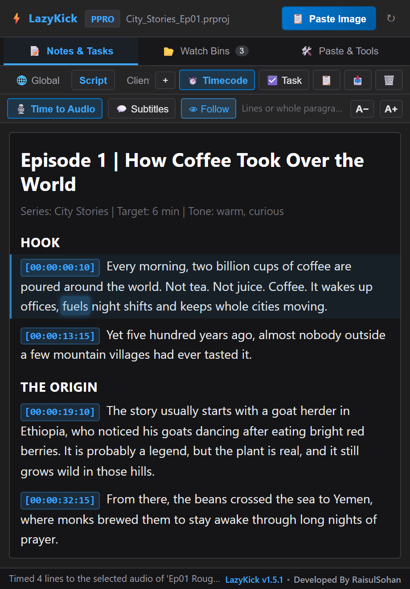
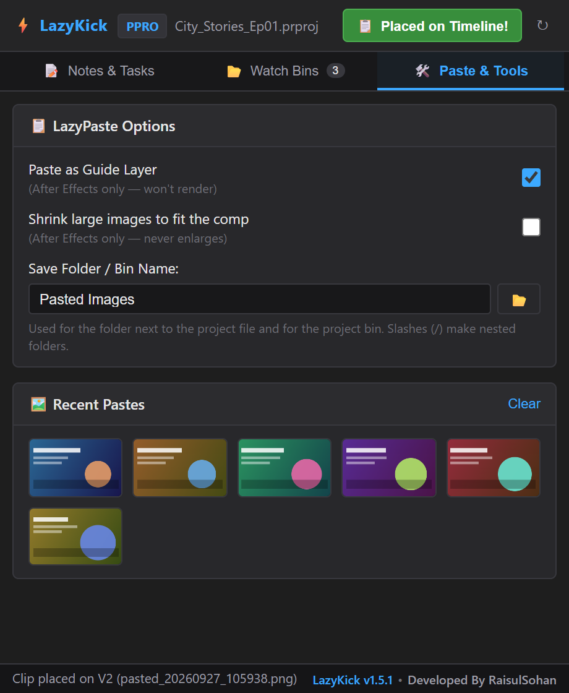
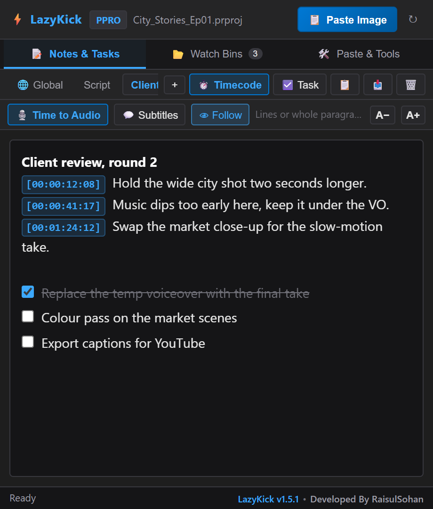
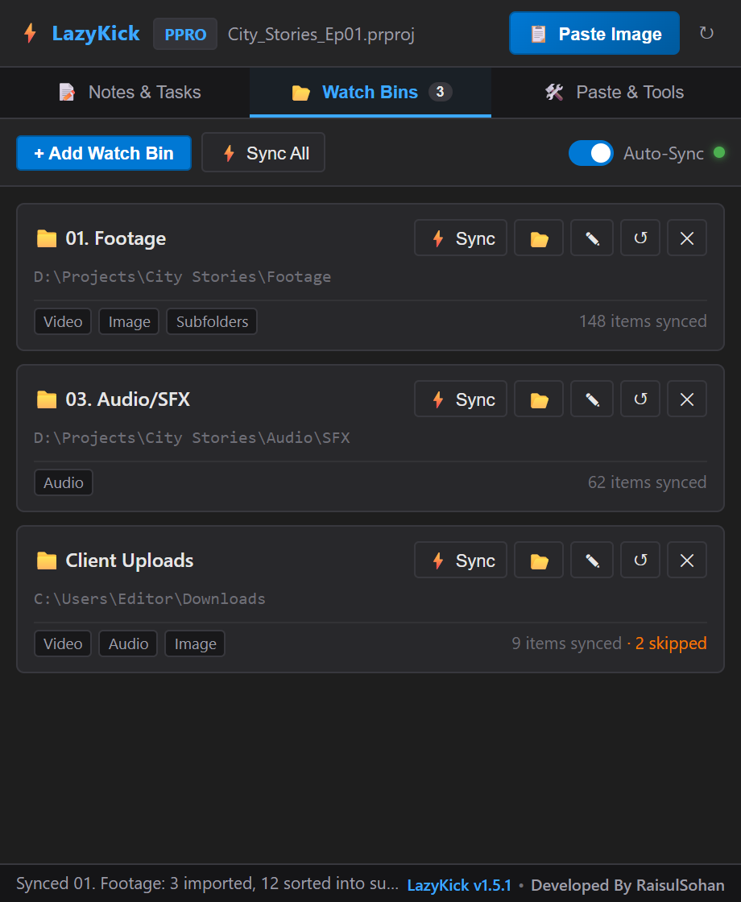
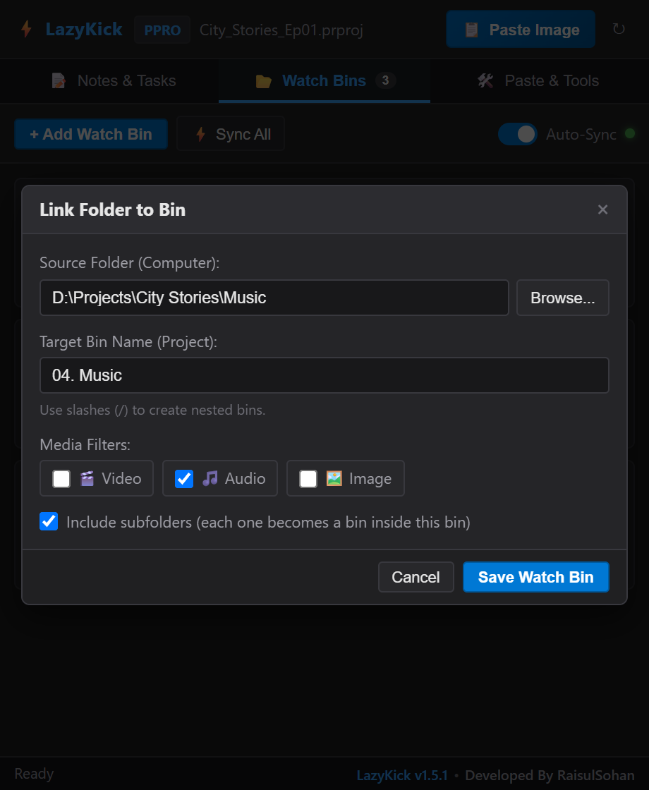
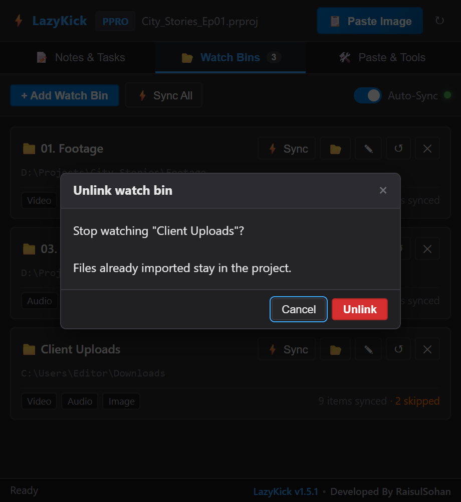

# The LazyKick manual

Everything the panel does, in the order you meet it. *Written for LazyKick
1.5.1.* For how the script timing decides where each line goes, see
[How script timing works](script-timing.md); when something does not behave,
see [If something goes wrong](troubleshooting.md).

**Contents**

1. [Install, update, uninstall](#1-install-update-uninstall)
2. [The panel at a glance](#2-the-panel-at-a-glance)
3. [Paste an image onto the timeline](#3-paste-an-image-onto-the-timeline)
4. [Notes and tasks](#4-notes-and-tasks)
5. [Time a script to the voiceover](#5-time-a-script-to-the-voiceover)
6. [Make subtitles](#6-make-subtitles)
7. [Follow the voiceover while it plays](#7-follow-the-voiceover-while-it-plays)
8. [Watch bins](#8-watch-bins)
9. [Settings](#9-settings)
10. [Keyboard shortcuts](#10-keyboard-shortcuts)
11. [Where your data is kept](#11-where-your-data-is-kept)

---

## 1. Install, update, uninstall

**You need** Windows 10 or 11, or macOS, with After Effects CC 2019 (16.0)
or newer and/or Premiere Pro 2020 (14.0) or newer.

### Install or update

1. Download **`LazyKick-v1.5.1.zip`** from the
   [latest release](https://github.com/raisulsohan/LazyKick/releases/latest)
   and unzip it anywhere (the Desktop is fine).
2. Close After Effects and Premiere Pro.
3. Run the installer:
   - **Windows:** double-click `Install LazyKick.bat`
   - **macOS:** double-click `Install LazyKick (macOS).command`. If macOS
     refuses, right-click it and choose **Open**.
4. Wait for **Installed**, press a key, then start the app and open
   **Window › Extensions › LazyKick**. Dock it wherever you like.

The panel inside the zip is signed and timestamped, so Adobe loads it
without any extension manager or debug setting. Installing over an older
LazyKick replaces the panel and **keeps your notes, watch bins and
settings**; they live in a separate folder
([section 11](#11-where-your-data-is-kept)).

Where the installer puts the panel:

- Windows: `%APPDATA%\Adobe\CEP\extensions\com.sohan.LazyKick`
- macOS: `~/Library/Application Support/Adobe/CEP/extensions/com.sohan.LazyKick`

Two copies with the same ID clash, so the installer moves a LazyKick 1.0
copy (a folder named `LazyKick` in the same place) aside to
`CEP/LazyKick-old-copy`. It is moved, never deleted. A copy installed for
all users under `C:\Program Files (x86)\Common Files\Adobe\CEP\extensions\LazyKick`
is only reported, because removing it needs administrator rights; delete that
folder yourself.

The zip also holds `Read me first.txt`, `Fix a blank panel.bat` (see
[the panel opens blank](troubleshooting.md#the-panel-opens-blank)) and the
uninstallers.

### Uninstall

Run `Uninstall LazyKick.bat` (Windows) or
`Uninstall LazyKick (macOS).command` with the Adobe apps closed. It removes
the panel, then **asks** whether to delete your notes, watch bins and
settings as well. Pasted images always stay in the folders next to your
projects.

Developers who want to run the panel from a clone of the repository: see
[Building from source](development.md#running-it-from-the-repository).

---

## 2. The panel at a glance

- **Header:** the host badge (**AE** or **PPRO**), the name of the open
  project (hover it for the full path), **📋 Paste Image**, and **↻**, which
  reads the project again if the panel ever shows the wrong one.
- **Tabs:** **📝 Notes & Tasks**, **📂 Watch Bins** (with the number of linked
  folders) and **🛠️ Paste & Tools**.
- **Status bar** at the bottom: what just happened, or why something did
  not. Hover it to read a long message in full. The footer shows the
  version and a link to the developer's website.

The panel follows the project you have open. Switch projects in the app and
the notes and watch bins switch with it, within a few seconds.

---

## 3. Paste an image onto the timeline

**📋 Paste Image** takes whatever picture is on the clipboard, saves it next
to your project and places it at the playhead.

1. **Save your project**, so the image can be stored beside it.
2. Open the composition (After Effects) or sequence (Premiere Pro) and put
   the playhead where the image should start.
3. Copy a picture: a screenshot (`Win+Shift+S`, `Cmd+Ctrl+Shift+4`),
   *Copy Image* in a browser or any app, or an **image file** copied in
   Explorer or Finder (`.png .jpg .jpeg .gif .bmp .tif .tiff .webp .psd`).
4. Click **📋 Paste Image**, or click anywhere in the panel outside the notes
   and press **Ctrl+V** (**Cmd+V**).

The button reads **Reading Clipboard…**, then **Placing on timeline…**, and
turns green: **Placed on Timeline!** The status bar says where it went, such
as *Clip placed on V2*.

**Where the image is saved:** in `Pasted Images` next to the project file, as
`pasted_YYYYMMDD_HHMMSS.png`. A PNG on the clipboard keeps its
transparency. A copied image file keeps its own format. Two pastes in the
same second get `_2`, `_3` names; nothing is ever overwritten. For a project
that has never been saved, images go to `LazyKick_Pasted_Images` in your home
folder.

**Pasting the same picture again** reuses the file already saved in that
folder and the item already in the project. LazyKick recognises it by its
contents (a checksum), not its name.

**In After Effects** the image becomes a layer in the active composition,
starting at the current time, in one undo step. By default it is a **guide
layer**: you see it while you work, but it never renders. *Shrink large
images to fit the comp* scales images bigger than the composition down (small
ones are never enlarged). With no composition open, the image goes into the
project folder only.

**In Premiere Pro** the image is imported into the paste bin and placed on the
**lowest unlocked video track that is empty at the playhead for the still's
whole duration**, with an overwrite into that empty space. **Clips already on
the timeline never move and are never covered.** If every track is busy, the
image stays in the bin and the status bar says *No free video track at the
playhead*. Add an empty track (or unlock one) and paste again.

**Recent Pastes** (on the 🛠️ Paste & Tools tab) shows the last 12 images,
kept across restarts. Click one to place it again. **Clear** empties the
list (the files stay on disk). The 📂 button beside *Save Folder / Bin Name*
opens this project's paste folder.

---

## 4. Notes and tasks

Notes are **per project** and **save themselves** a moment after you stop
typing. Each project can have several tabs.

- **🌐 Global** is one scratchpad shared by every project: colour codes,
  hashtags, export settings, anything you reuse.
- **+** adds a tab. **Double-click a tab** to rename it (Enter saves, Esc
  cancels). **🗑️** deletes the current tab after asking; its text cannot be
  brought back. Global cannot be deleted, and a project keeps at least one
  tab.
- **⏱️ Timecode** inserts the playhead time at the caret, like
  `[00:01:24:12]`, in the format the app shows (After Effects uses the
  project's display setting and the composition's start time).
- **☑️ Task** inserts a checkbox line. Tick it to strike it through.
- **📋** copies the tab as plain text, with tasks written as `[ ]` and `[x]`.
- **📥** exports the tab as `Note_<project>_<tab>.txt` next to the project
  (or in your home folder for an unsaved project), never overwriting an
  earlier export.

**Unsaved projects:** notes and watch bins made before a project is first
saved move to the saved project when you save it (within two minutes of
saving). Opening a different existing project instead leaves them with the
untitled one.

**After Effects and Premiere Pro** each have their own notes, because they
belong to the project file (an `.aep` and a `.prproj` are different files).
Only 🌐 Global is shared by both.

### Pasting text

Paste a script from **Google Docs, Word or a web page** and it keeps its
shape, in the panel's own dark style:

| In the document | In the notes |
| --- | --- |
| Title, large text | Big heading |
| Heading, bold short line (no full stop) | Heading |
| Paragraph | Paragraph |
| **Bold**, *italic*, underline | Kept |
| Bullet or numbered list | Lines starting with `•` or `1.` |
| Small or grey text (a meta line) | Grey side note |
| Table | One line per row, cells joined with `\|` |

Fonts, colours, sizes, links, images, hidden text and scripts are left
behind: the pasted document is read and rebuilt from these few parts, never
inserted as it came. A short phrase pastes into the current line.

**Ctrl+Shift+V** (**Cmd+Shift+V**) pastes plain text. Copying an image file
into the notes does nothing; the status bar reminds you that images go to the
timeline with **📋 Paste Image**.

**A− / A+** make the note text smaller or bigger, from 10 to 24 pixels
(14 by default). The size is remembered; headings scale with it.

---

## 5. Time a script to the voiceover

**🎙️ Time to Audio** listens to the open sequence or composition and starts
every spoken line of the note with the time it is said. It works in any
language, needs no internet and no speech recognition: it finds the pauses
in the voice and matches every sentence to the speech by how long it takes
to say. [How script timing works](script-timing.md) has the detail.

1. Put the voiceover on the timeline and keep that sequence (Premiere Pro)
   or composition (After Effects) open.
2. Write or paste the script into a note tab, **in the order it is spoken**.
   One sentence per line, a paragraph per line, or a whole document pasted
   from Google Docs all work.
3. Music or effects on the timeline too? **Select the voiceover clip
   (Premiere Pro) or layer (After Effects) first.** Only the selected audio
   is heard; the other tracks are muted (Premiere) or their audio switched
   off (After Effects) for the moment and switched back on afterwards.
4. Click **🎙️ Time to Audio**. The status bar reads *Listening to the
   timeline audio…* and then *Timed 12 lines to the selected audio of
   'Rough Cut'*.

Each spoken line now starts with a timecode tag in the timeline's own
timecode, like `[00:00:13:15]`. Clicking 🎙️ again re-times every line and
replaces the tags; it never adds a second one.

**What counts as a spoken line:** every paragraph or line with words in it.
**Left out** are headings (and titles), grey side notes, checklist items and
lines with no words, like `---`. So a pasted script with a title, a meta
line and section headings such as *HOOK* times correctly as it is.

**Fixing a line:** edit the numbers in its tag. A tag you typed or changed
(or one from **⏱️ Timecode**, including drop-frame `;` timecode) is read from
its text; LazyKick's own untouched tags keep their exact measured times.

**The script must match the recording:** same sentences, same order, nothing
left out. Remove what the voiceover skips and add what was ad-libbed, or the
lines after that point shift.

What happens behind the button:

- **Premiere Pro** exports the sequence's audio mix to a temporary WAV file
  with its own *Waveform Audio 48kHz 16-bit* preset, which LazyKick reads and
  deletes.
- **After Effects** measures the loudness of every frame with its own
  *Convert Audio to Keyframes*, then removes the helper layer. Your layer
  selection and work area are put back. It is one undo step.

---

## 6. Make subtitles

Click **💬 Subtitles** after timing the script (or on any lines that start
with a timecode tag).

- **Premiere Pro:** the subtitles are imported into a *Subtitles* bin and
  placed on the open sequence as a new **subtitle caption track**. Style
  them as usual in the Essential Graphics or Text panel. A Premiere version
  that cannot make caption tracks by script leaves them in the *Subtitles*
  bin, and the status bar asks you to drag them onto the sequence.
- **After Effects:** one text layer per subtitle, first subtitle on top, each
  trimmed to its time. White text with a dark outline, centred in a box
  across the lower third, sized to the composition (4.5 % of its height).
  Layers are named `Sub 01`, `Sub 02`, … followed by the start of their text.
  Subtitles in **Bengali** get a Bengali font (Nirmala UI, Vrinda, Shonar
  Bangla, Kohinoor Bangla, Bangla Sangam MN or Noto Sans Bengali, whichever
  is installed) and the Universal Type Engine, which joins the letters
  correctly. Change all of them at once by selecting them and using the
  Character panel. Subtitles past the end of the composition are left out
  and counted in the status bar.
- **Both:** an `.srt` file (UTF-8, readable by YouTube and every editor) is
  saved in a `LazyKick Subtitles` folder next to the project, named after the
  sequence or composition, never overwriting an earlier one.

**Long lines become several subtitles.** A line longer than 84 characters
(two subtitle lines of 42) or longer than 6.5 seconds is cut into pieces:
at a sentence end if that leaves the piece at least a third full, otherwise
at a comma, otherwise between words. Each piece starts when its first word
is spoken. Short lines are wrapped into two lines at the space nearest the
middle.

A line with no measured end (a tag you typed) stays up for its reading time
and never runs into the next subtitle.

---

## 7. Follow the voiceover while it plays

With **👁 Follow** on (it is on by default), press play: the line being
spoken gets a soft blue band, the word being said glows, and the note
scrolls so the line stays in view. Scrubbing works too. No more searching
for where you are in a long script.

- It needs timed lines (🎙️ Time to Audio, or lines starting with a
  timecode).
- Scroll, click or type in the note and it waits a moment before scrolling
  again, so it never fights you.
- The highlight is drawn over the note, never into it, so nothing of it is
  saved or copied.
- Click **👁 Follow** to switch it off or on; the choice is remembered.

The panel asks the app where the playhead is five times a second while it
moves and about once a second while it rests, and glides the highlight in
between. It asks nothing while the Notes tab is hidden, a dialog is open or
the note has no timecodes. In After Effects the playhead may only report its
position when playback stops or when you scrub, depending on how the preview
is running.

---

## 8. Watch bins

A watch bin links a folder on your computer to a bin in the project. New
media in the folder is imported into the bin, once, and never while it is
still being copied.

### Link a folder

1. Open **📂 Watch Bins** and click **+ Add Watch Bin**.
2. **Browse…** to a folder, or paste its path. The browser shows your drives
   (Windows) or Home, Desktop and Volumes (macOS), and opens where you last
   picked a folder.
3. Name the bin. Slashes make nested bins: `Footage/Interviews`. Leave it
   empty and it takes the folder's name.
4. Choose the **media filters** (🎬 Video, 🎵 Audio, 🖼️ Image) and whether to
   **include subfolders**.
5. Click **Save Watch Bin**. The first sync runs straight away.

### What a sync does

- **Imports what is new** into the bin, in Explorer's order (subfolders
  first, `Day 2` before `Day 10`).
- **Mirrors the folder.** With *Include subfolders* on,
  `Shoot/Day 1/Cam A/clip.mp4` goes into the bin `Shoot › Day 1 › Cam A`,
  nested like the folders on disk. Bins are only made for folders that hold
  media. A bin that differs only in capitals or spaces (`day 1` and `Day 1`)
  is reused, not duplicated.
- **Sorts what is already there.** Media inside the watch bin that sits in
  the wrong sub-bin is moved to the bin its folder maps to, so a bin synced
  flat by an old version, or clips moved around inside it, are put back in
  order.
- **Never imports twice.** A file already anywhere in the project, in any
  bin, is left where it is and counts as synced. Linking a folder you
  imported by hand is safe.
- **Uses the bin you already have.** Link a folder the project already has a
  bin for (named like the folder or the watch bin, holding its files) and
  that bin becomes the watch bin, wherever it sits and however it is
  capitalised; the card shows where. Copies of it are folded in: bins of the
  same name beside it, and bins of that name elsewhere that hold nothing but
  this folder's media. A copy is deleted only once it is completely empty.
- **Follows files you moved.** When a file shows up in another folder and
  its old clip has gone offline, the clip is relinked to the new place and
  moved to the matching bin, instead of a second copy being imported. Your
  sequences and comps keep working. This happens only when the match is
  certain: the same file name, and the folder names tell it apart from every
  other candidate. Otherwise the file is imported and the old clip stays
  offline.

LazyKick **never moves anything outside the watch bin** and never deletes a
clip or a bin that holds anything. To organise clips your own way, drag them
out of the watch bin (into a *Selects* bin, say) and they stay where you put
them.

Adobe's own folders inside a project folder (*Adobe Premiere Pro Auto-Save*,
*Video Previews*, *Audio Previews*, *Adobe After Effects Auto-Save*) are
never imported, so watching a project folder does not pull in render
previews.

### Syncing

- **⚡ Sync** on a card syncs that folder now: imports, sorts and retries
  skipped files.
- **⚡ Sync All** does every card, one after another.
- **Auto-Sync** (the switch, remembered) scans every 6 seconds and imports a
  new file on the scan **after** its size stopped changing, so a download or
  copy in progress is never imported half-written. Allow about 12 seconds.
  It sorts each bin once per session and then only imports new files. The
  dot next to the switch is green while it is on.

Sync jobs run one at a time, so a quick double click or an overlapping
Auto-Sync can never import a file twice. If you switch projects while a sync
is waiting, it is skipped rather than importing into the wrong project.

### The card

| | |
| --- | --- |
| **⚡ Sync** | Sync this folder now. |
| **📂** | Open the folder in Explorer or Finder. |
| **✎** | Edit the folder, bin name, filters or subfolder setting. Files that no longer match are dropped from the card's list; then it syncs. |
| **↺** | Reset: forget which files were synced and sync again. Files you deleted from the project come back; files still in it are not imported twice. |
| **✕** | Unlink the folder. Files already imported stay in the project. |

The chips show the filters and *Subfolders*. **N items synced** counts the
files imported from this folder. **· N skipped** (orange) means the app
refused those files, being an unsupported format or damaged. Hover it for
the names. They are tried again once they change, or when you click ⚡ Sync.

Actions that cannot be undone ask first, in the panel's own dialog. The
risky button is red and **Cancel** has the focus, so pressing Enter never
unlinks or deletes anything by accident.

### File types

| Filter | Extensions |
| :--- | :--- |
| 🎬 Video | `.mp4` `.mov` `.avi` `.mkv` `.webm` `.m4v` `.mpg` `.mpeg` `.mxf` `.mts` `.m2ts` `.wmv` |
| 🎵 Audio | `.mp3` `.wav` `.aac` `.flac` `.m4a` `.ogg` `.aif` `.aiff` `.wma` |
| 🖼️ Image | `.jpg` `.jpeg` `.png` `.tif` `.tiff` `.exr` `.dpx` `.tga` `.bmp` `.psd` `.ai` `.gif` `.webp` `.heic` `.svg` |

Whether a file really imports is up to the app and its version; refusals
show as *skipped*. Always ignored: hidden files (names starting with `.`,
including macOS `._` files), Office lock files (`~$…`), empty files, and
camera raw (`.cr2`, `.nef`, `.arw`, …), because After Effects opens a dialog
for each one. Linked (symbolic) folders are not followed, so a loop cannot
trap a scan, and big folders are scanned without freezing the panel.

---

## 9. Settings

Every setting is remembered across restarts.

| Where | Setting | Default | What it does |
| :--- | :--- | :--- | :--- |
| 🛠️ Paste & Tools | Paste as Guide Layer | On | After Effects: pasted layers are guide layers (shown, never rendered). |
| 🛠️ Paste & Tools | Shrink large images to fit the comp | Off | After Effects: scales images larger than the composition down to fit. Never enlarges. |
| 🛠️ Paste & Tools | Save Folder / Bin Name | `Pasted Images` | The folder next to the project **and** the project bin the images go into. `/` makes nested folders; `..` and characters Windows forbids are removed. |
| 📝 Notes | A− / A+ | 14 px | Note text size, 10 to 24 px. |
| 📝 Notes | 👁 Follow | On | Highlight the spoken line and word while the timeline plays. |
| 📂 Watch Bins | Auto-Sync | Off | Import new media in the background every 6 seconds. |

The folder browser also remembers the last folder you picked.

---

## 10. Keyboard shortcuts

| Shortcut | Where | Does |
| :--- | :--- | :--- |
| `Ctrl+V` / `Cmd+V` | Panel focused, outside text fields | Paste Image |
| `Ctrl+V` / `Cmd+V` | Notes | Paste, keeping headings, bold, italic and lists |
| `Ctrl+Shift+V` / `Cmd+Shift+V` | Notes | Paste plain text |
| Double-click | Note tab | Rename (Enter saves, Esc cancels) |
| `Enter` / `Esc` | Dialog | OK / Cancel (Cancel is focused on red dialogs) |
| `Enter` | Folder browser path box | Go to that path |
| Double-click | Folder in the folder browser | Open it |

---

## 11. Where your data is kept

Everything stays on your computer, in:

- **Windows:** `%APPDATA%\AdobeProjectNotepad\`
- **macOS:** `~/Library/Application Support/AdobeProjectNotepad/`

(The folder is named after the tool LazyKick grew out of, so notes from
older versions are still found.)

| File | Holds |
| :--- | :--- |
| `proj_<number>.json` | The note tabs of one project |
| `bins_proj_<number>.json` | The watch bins of one project, with the files synced and skipped |
| `global_scratchpad.txt` | The 🌐 Global tab |
| `lazykick_settings.json` | Paste options, text size, Follow, Auto-Sync and the last folder picked |
| `recent_pastes.json` | The Recent Pastes list |
| `paste_index.json` | Checksums of pasted images, to recognise a picture pasted again |

Pasted images live next to your projects, subtitle files in
`LazyKick Subtitles` next to them. Back up the folder above to keep your notes
when you move to a new computer.

**Privacy:** LazyKick makes **no network requests**. It reads the clipboard
only when you paste, audio only when you click 🎙️ Time to Audio, and only
the folders you link. The one link it opens is the developer's website in
the footer, when you click it.
